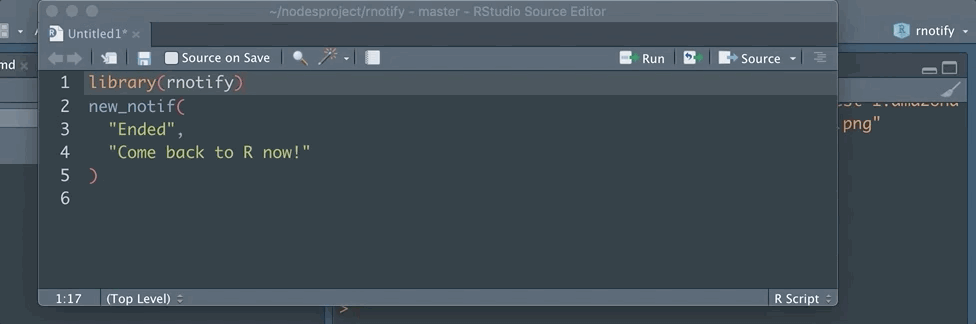

<!-- README.md is generated from README.Rmd. Please edit that file -->

# rnotify

A very simple wrapper around `node-notifier CLI`, “A Node.js module for
sending notifications on native Mac, Windows and Linux (or Growl as
fallback)” [link](https://github.com/mikaelbr/node-notifier).

## Installation

### Node Module

**You’ll need to have a working installation of the Node JS module
`node-notifier-cli`**, which you can install with:

    sudo npm i -g node-notifier-cli

Check that it works by running in your console:

    notify -t "Hello" -m "My Message"

### R Package

``` r
remotes::install_github("ColinFay/rnotify")
```

## Run

Launch notification with:

``` r
library(rnotify)
new_notif(
  "Ended", 
  "Come back to R now!"
)
```



Only title and message are mandatory. Other possible args are:

  - `subtitle` Subtitle of the notification (not available on windows).
  - `sound` Sound of the notification

## Returned object

The returned object from `new_notif()` is the result
`processx::process$new()` and can be handled as such.

## Prior work

  - [{notifier}](https://github.com/gaborcsardi/notifier)

## CoC

Please note that the `rnotify` project is released with a [Contributor
Code of Conduct](CODE_OF_CONDUCT.md). By contributing to this project,
you agree to abide by its terms.
